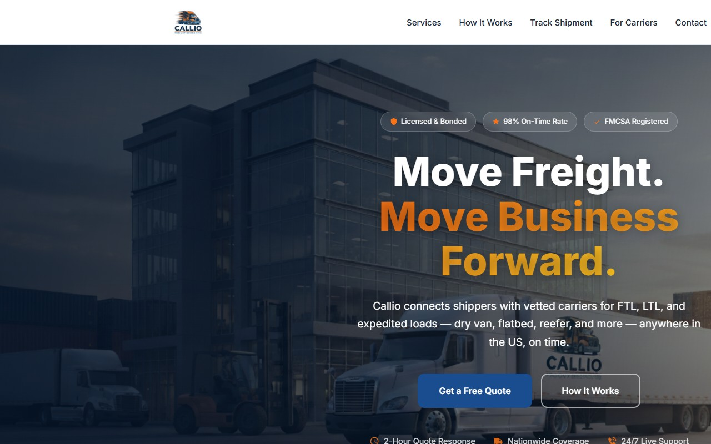

# Callio Freight Brokering

 
 

> **Sitio web corporativo para una empresa de freight brokering en Estados Unidos — con sistema de cotizaciones automatizado y notificaciones en tiempo real por email.**

> Este es un **portfolio showcase** — el codigo fuente es propietario y no esta incluido.

---

## El Sitio

**[freightbroker.joincallio.com](https://freightbroker.joincallio.com/)** — sitio en produccion.

---

## El Problema

Callio Freight Brokering necesitaba una presencia web profesional que:

- Transmitiera credibilidad ante shippers y carriers en el mercado de transporte de carga de EE.UU.
- Capturara solicitudes de cotizacion (FTL, LTL, Expedited) 24/7 sin intervencion manual
- Notificara al equipo de inmediato cuando llega un nuevo lead
- Enviara confirmacion automatica al cliente para mejorar la conversion

---

## La Solucion

Sitio estatico de alto impacto visual con un backend Node.js que orquesta el flujo completo de cotizacion — desde la validacion del formulario hasta la entrega de emails transaccionales a ambas partes.

---

## Funcionalidades

| Funcionalidad | Descripcion |
|--------------|-------------|
| Formulario de cotizacion | Captura tipo de carga, origen, destino, peso y fecha de envio |
| Notificacion al equipo | Email HTML formateado al equipo de Callio via SendGrid |
| Confirmacion al cliente | Email automatico con resumen del pedido y tiempo de respuesta estimado |
| Validacion en tiempo real | Feedback de errores sin recargar la pagina |
| Diseno responsive | Optimizado para desktop y movil |
| Pagina para carriers | Seccion dedicada para conductores independientes interesados en trabajar con Callio |

---

## Stack Tecnologico

| Capa | Tecnologia |
|------|-----------|
| Frontend | HTML5 · CSS3 · JavaScript Vanilla |
| Backend | Node.js · Express 4 |
| Email | SendGrid API |
| Despliegue | VPS · Nginx |

---

## Vista Previa

---

## Contacto

El codigo fuente es propietario. Para consultas: [pablozam1931@gmail.com](mailto:pablozam1931@gmail.com)

---

*Parte del portfolio [deadlyrat](https://github.com/deadlyrat).*
