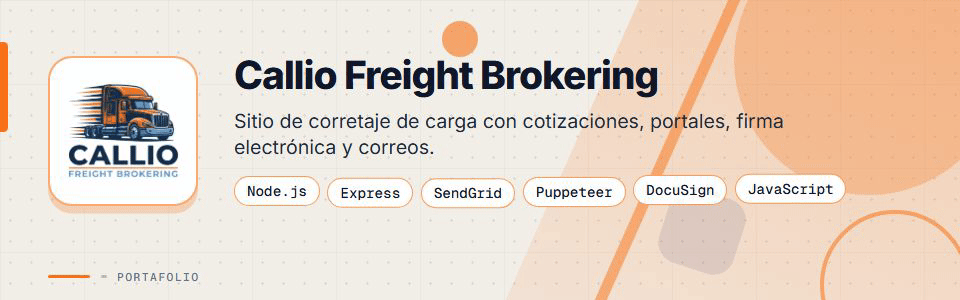
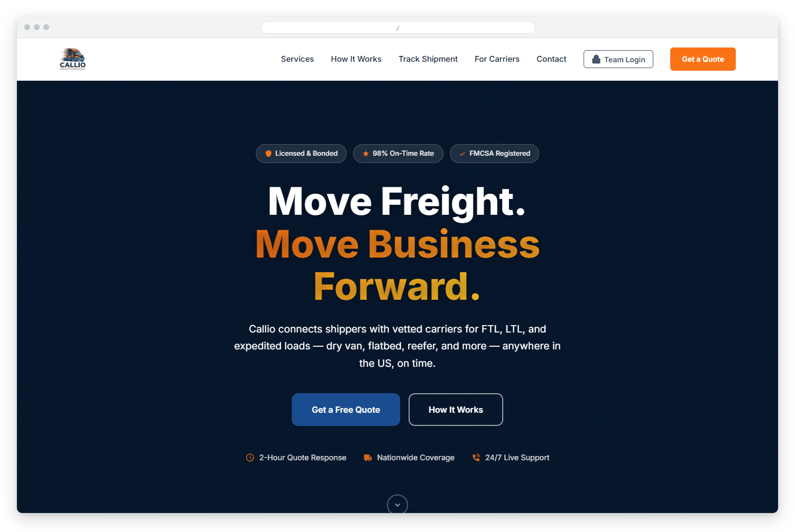
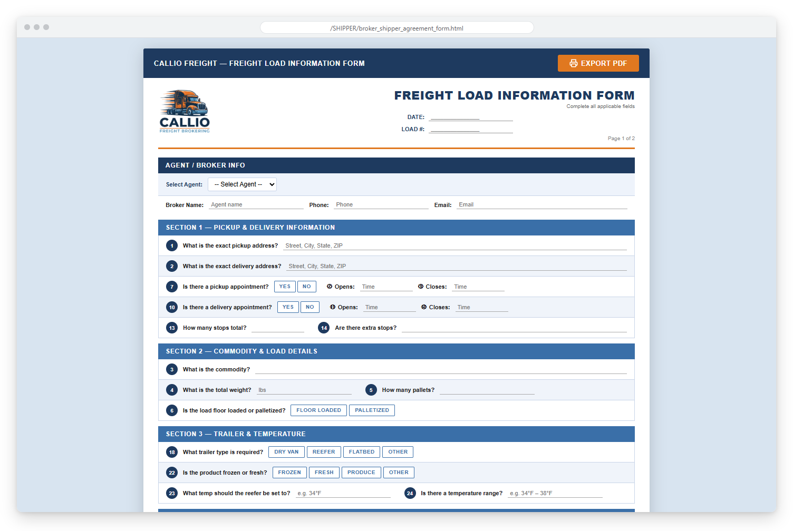
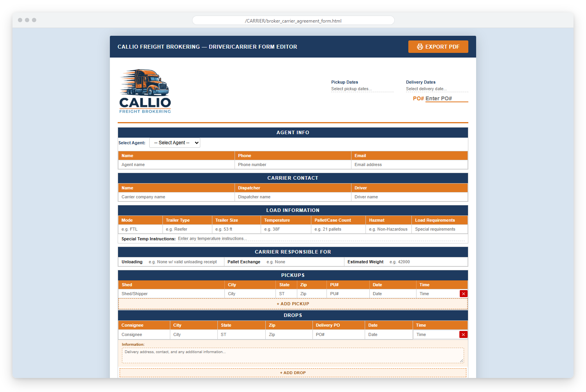
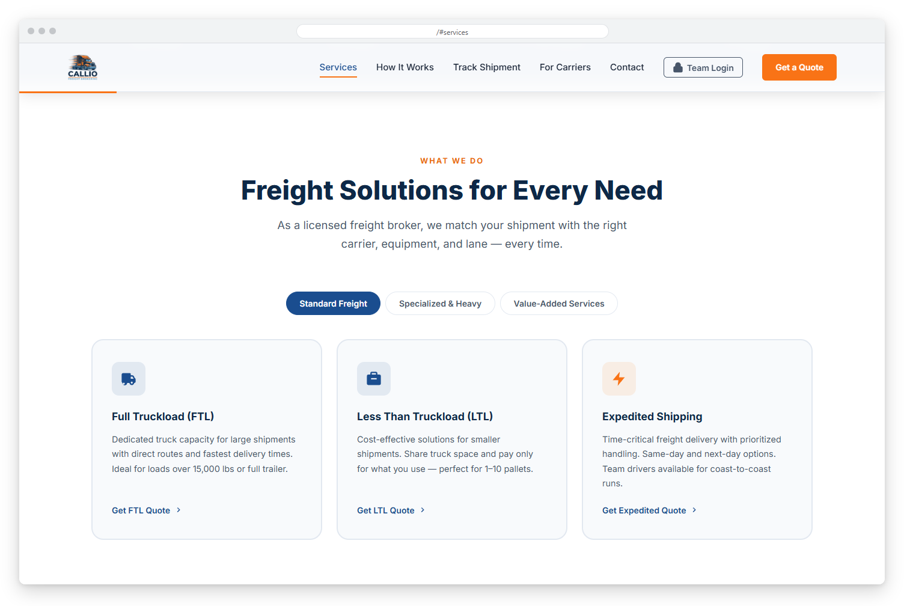
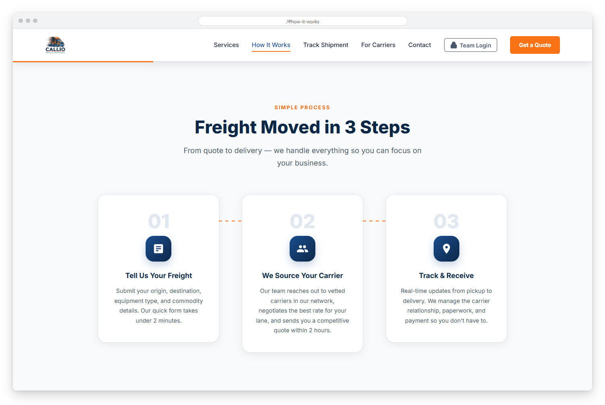
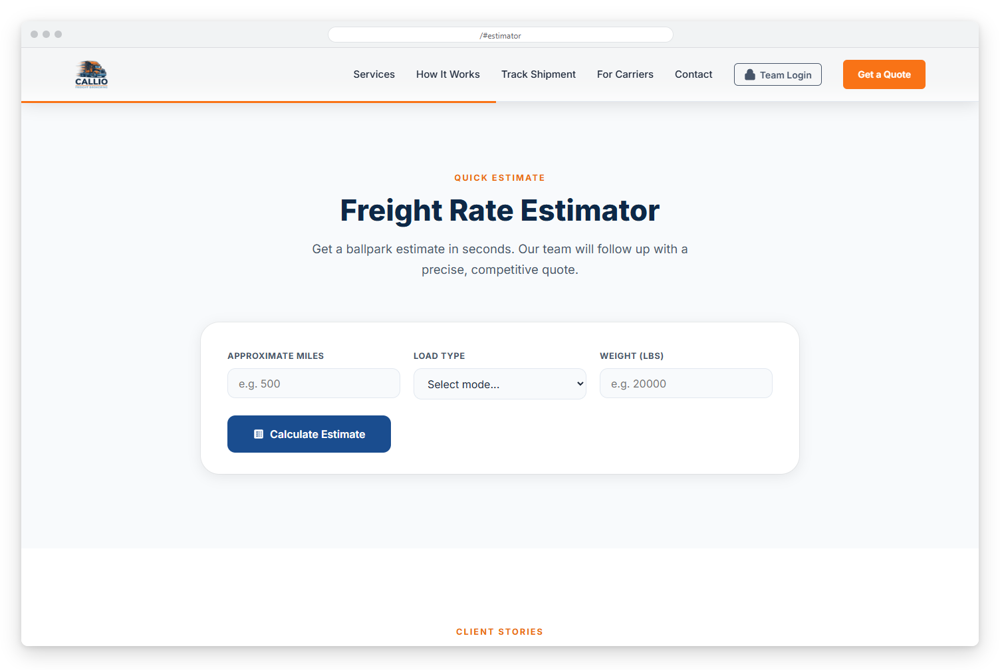
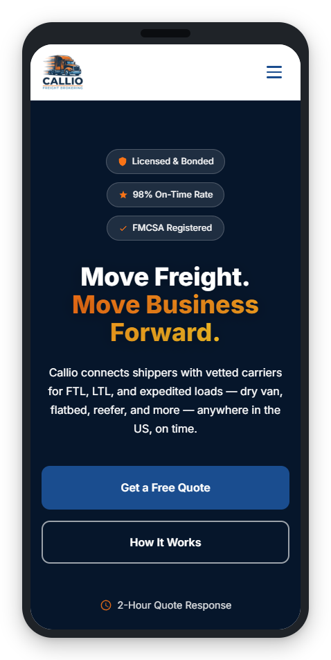
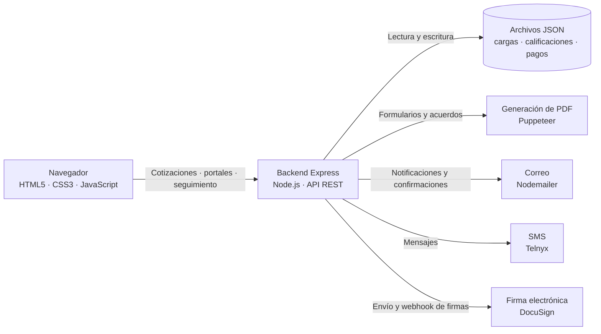

<div align="center">



# Callio Freight Brokering


**Plataforma web para una empresa de freight brokering en Estados Unidos: sitio corporativo, cotizaciones automatizadas, portales para transportistas y remitentes, y firma de documentos.**

**[Ver el sitio en producción](https://freightbroker.joincallio.com/)**

</div>

> Este es un **portafolio showcase**: el código fuente es propietario y no está incluido.

---

## Contenido

- [El Problema](#el-problema)
- [La Solución](#la-solución)
- [Funcionalidades](#funcionalidades)
- [Vista Previa](#vista-previa)
- [Arquitectura](#arquitectura)
- [Stack Tecnológico](#stack-tecnológico)
- [Instalación local](#instalación-local)
- [Roadmap](#roadmap)
- [Contacto](#contacto)

---

## El Problema

Callio Freight Brokering necesitaba una presencia web profesional y herramientas operativas que le permitieran:

- Transmitir credibilidad ante remitentes y transportistas en el mercado de carga de EE. UU.
- Capturar solicitudes de cotización (FTL, LTL y envíos urgentes) las 24 horas, sin intervención manual.
- Notificar al equipo de inmediato cuando llega un nuevo lead y confirmar al cliente de forma automática.
- Gestionar cargas, acuerdos firmados y comunicación con transportistas y remitentes desde un solo lugar.

---

## La Solución

Un sitio de alto impacto visual con un backend Node.js y Express que orquesta todo el flujo: desde la validación de la cotización hasta el envío de correos transaccionales a ambas partes. Sobre esa base se añadieron un portal interno, portales para transportistas y remitentes, una app para conductores, seguimiento de cargas, firma electrónica de acuerdos y mensajería SMS.

---

## Funcionalidades

| Funcionalidad | Descripción |
|--------------|-------------|
| Solicitud de cotización | Formulario con tipo de carga, origen, destino, peso y fecha de envío, con validación en tiempo real |
| Correos automáticos | Notificación al equipo y confirmación al cliente con el resumen del pedido |
| Formularios de carga y transportista | Hojas editables que se generan como PDF y se envían por correo |
| Firma de documentos | Acuerdos entre corredor, transportista y remitente enviados para firma electrónica con DocuSign, con recepción de documentos firmados |
| Portal interno | Acceso con usuarios y roles para gestionar cargas, solicitudes de seguimiento, documentos firmados y cuentas |
| Portal de transportistas | Verificación, historial de cargas, carga de BOL y solicitudes de pago |
| Portal de remitentes | Acceso para consultar cargas y solicitar nuevos envíos |
| App de conductor y seguimiento | Actualizaciones del conductor y página pública de seguimiento por número de carga |
| Mensajería SMS | Envío y recepción de mensajes con transportistas y clientes mediante Telnyx |
| Calificación y emparejamiento | Calificaciones de transportistas y sugerencias de transportistas para cada carga |
| Analítica | Métricas y envío de reportes por correo para administradores |
| Diseño responsive | Optimizado para escritorio y móvil |

---

## Vista Previa



<table>
  <tr>
    <td width="50%">
      
      <br><b>Formulario de carga</b>: datos de recogida, entrega, mercancía y tipo de remolque.
    </td>
    <td width="50%">
      
      <br><b>Hoja del transportista</b>: contacto, carga, recogidas y entregas en un solo editor.
    </td>
  </tr>
  <tr>
    <td width="50%">
      
      <br><b>Servicios</b>: carga completa (FTL), carga parcial (LTL) y envíos urgentes.
    </td>
    <td width="50%">
      
      <br><b>Cómo funciona</b>: el proceso de cotización y entrega en tres pasos.
    </td>
  </tr>
  <tr>
    <td width="50%">
      
      <br><b>Estimador de tarifas</b>: cálculo rápido según millas, tipo de carga y peso.
    </td>
    <td width="50%"></td>
  </tr>
</table>



**Versión móvil**: la página de inicio adaptada a pantallas pequeñas.

---

## Arquitectura



**API REST:** `POST /api/quote` para cotizaciones, rutas `/api/portal/*` protegidas por sesión para cargas, usuarios, documentos firmados, SMS y analítica, además de rutas para transportistas, remitentes, conductores y seguimiento público (`GET /api/track/:loadNumber`).

---

## Stack Tecnológico

| Capa | Tecnología |
|------|-----------|
| Frontend | HTML5 · CSS3 · JavaScript vanilla |
| Backend | Node.js · Express 4 · express-session |
| Correo | Nodemailer |
| SMS | Telnyx |
| Firma electrónica | DocuSign |
| PDF | Puppeteer |
| Archivos | Multer |
| Datos | Archivos JSON en el servidor (sin base de datos) |
| Despliegue | VPS · PM2 · Nginx |

---

## Instalación local

> **Aviso:** el código es privado y propietario. Estos pasos son solo para colaboradores autorizados con acceso al repositorio.

1. Instala Node.js.
2. Instala las dependencias:
   ```bash
   npm install
   ```
3. Copia `.env.example` a `.env` y completa tus propios valores.
4. Inicia el entorno de desarrollo:
   ```bash
   npm run dev
   ```
5. Para producción:
   ```bash
   npm start
   ```

---

## Roadmap

- [ ] Migrar el almacenamiento de archivos JSON a una base de datos.
- [ ] Pruebas automatizadas para los flujos de cotización y firma.
- [ ] Panel de métricas con más indicadores para el equipo.

---

## Contacto

El código fuente es propietario. Para consultas o propuestas, escríbeme:

[](mailto:pablozam1931@gmail.com)
[%206517--1870-25D366?style=for-the-badge&logo=whatsapp&logoColor=white)](https://wa.me/50765171870)
[](https://github.com/deadlyrat)

- Correo: [pablozam1931@gmail.com](mailto:pablozam1931@gmail.com)
- WhatsApp: [(507) 6517-1870](https://wa.me/50765171870)
- GitHub: [github.com/deadlyrat](https://github.com/deadlyrat)

---

*Parte del portafolio de [deadlyrat](https://github.com/deadlyrat)*
